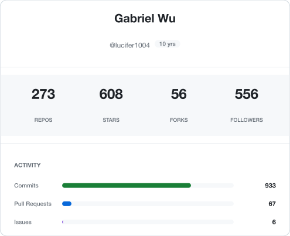
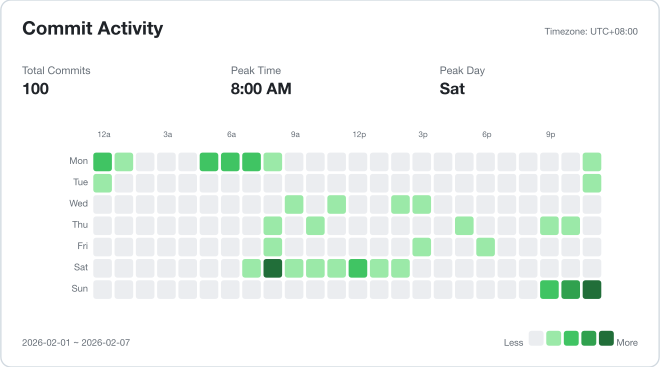
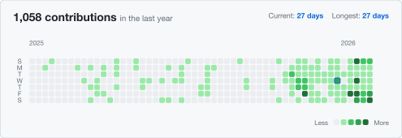
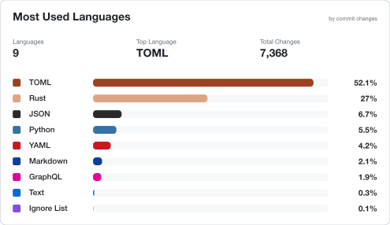
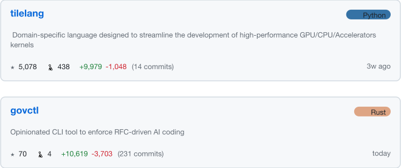

# github-stats-typst

Beautiful GitHub stats cards for your profile README.

## Examples

### Profile Card



### Commit Activity (Time Distribution)



### Contribution Heatmap



### Top Languages



### Pinned Repositories



### Dark Theme


---

## Setup (2 minutes)

### Step 1 (Optional): Create a Personal Access Token

1. Go to [GitHub Settings → Developer settings → Personal access tokens → Tokens (classic)](https://github.com/settings/tokens)
2. Click **Generate new token (classic)**
3. Select scopes:
   - `read:user` — required for profile and contribution data
   - `repo` — required if you want to include private repositories (pinned or otherwise)
4. Copy the token (optional; `GITHUB_TOKEN` only works for public data in the current repo)

### Step 2 (Optional): Add the Token to Your Profile Repo

1. Go to your profile repo: `github.com/YOUR_USERNAME/YOUR_USERNAME`
   - Don't have one? [Create it](https://github.com/new) with your username as the repo name
2. Go to **Settings → Secrets and variables → Actions**
3. Click **New repository secret**
4. Name: `GHT`, Value: paste your token

### Step 3: Create the Workflow

Create `.github/workflows/stats.yml`:

```yaml
name: Update Stats
on:
  schedule:
    - cron: "0 0 * * *"
  workflow_dispatch:
permissions:
  contents: write
jobs:
  update:
    runs-on: ubuntu-latest
    steps:
      - uses: actions/checkout@v6
      - uses: lucifer1004/github-stats-typst@v1
        with:
          username: ${{ github.repository_owner }}
          token: ${{ secrets.GHT || github.token }}
      - run: |
          git config user.name 'github-actions[bot]'
          git config user.email 'github-actions[bot]@users.noreply.github.com'
          git add *.svg
          if ! git diff --staged --quiet; then
            git commit -m 'Update stats'
            git push
          fi
```

### Step 4 (Optional): Add Configuration

Create `github-readme-stats.toml` for advanced options:

```toml
[time]
timezone = "+08:00"

[repos]
pinned = ["owner/repo1", "owner/repo2"]
orgs = ["my-org"]

[language]
commits_limit = 1000
top_n = 10
exclude = ["HTML", "CSS"]
```

### Step 5: Add to README

Add to your `README.md`:

```markdown


```

### Step 6: Run It

Go to **Actions → Update Stats → Run workflow**

Done! Your stats will update daily.

---

## Customization

### Themes

```yaml
- uses: lucifer1004/github-stats-typst@v1
  with:
    username: ${{ github.repository_owner }}
    token: ${{ secrets.GHT || github.token }}
    theme: dracula # github, github-dark, dracula, monokai, nord, solarized-light, solarized-dark, gruvbox-dark, tokyo-night
```

### Choose Cards

```yaml
cards: profile,timedist,heatmap,pinned,language
```

| Card       | Description                                  |
| ---------- | -------------------------------------------- |
| `profile`  | Stats overview (repos, stars, commits, etc.) |
| `timedist` | When you commit (24h × 7 days heatmap)       |
| `heatmap`  | GitHub-style contribution calendar           |
| `pinned`   | Highlighted repositories                     |
| `language` | Top languages by commit changes              |

---

## Configuration File

All CLI options are configured via `github-readme-stats.toml`:

```toml
[time]
timezone = "+08:00"  # Timezone for commit time analysis

[repos]
pinned = ["owner/repo1", "owner/repo2"]  # Repos to highlight
orgs = ["my-org"]  # Include org repos in stats

[language]
commits_limit = 1000  # Commits to sample for language stats
top_n = 10  # Number of top languages
exclude = ["HTML", "CSS"]  # Languages to exclude
```

---

## Action Inputs

| Input         | Default            | Description                                                                                                               |
| ------------- | ------------------ | ------------------------------------------------------------------------------------------------------------------------- |
| `username`    | required           | GitHub username                                                                                                           |
| `token`       | optional           | GitHub PAT (`read:user`, add `repo` for private repos); `GITHUB_TOKEN` only covers public data in current repo            |
| `theme`       | `github`           | `github`, `github-dark`, `dracula`, `monokai`, `nord`, `solarized-light`, `solarized-dark`, `gruvbox-dark`, `tokyo-night` |
| `cards`       | `profile,timedist` | Cards to generate                                                                                                         |
| `output-dir`  | `.`                | Output directory                                                                                                          |
| `cli-version` | `latest`           | Version of github-readme-stats CLI                                                                                        |

---

## Local Development

```bash
# Install CLI
cargo install --git https://github.com/lucifer1004/github-readme-stats

# Set token
export GHT="ghp_..."

# Create config (optional)
cat > github-readme-stats.toml << 'EOF'
[time]
timezone = "+08:00"
EOF

# Fetch stats
github-readme-stats your-username -o stats.json

# Render cards
typst compile cards/profile.typ profile.svg \
  --root . --input theme=github --input stats=/stats.json
```

## Related

- [github-readme-stats](https://github.com/lucifer1004/github-readme-stats) — The CLI that fetches GitHub stats

## License

MIT
